# Ember

A two-line status line for [Claude Code](https://code.claude.com), plus a companion renderer for subagent rows. Line one is who and where. Line two is what it's costing you.

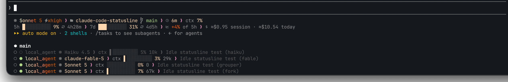

Native AOT, self-contained binary — no .NET runtime, no interpreter, nothing to install on the machine that runs it.

## What it shows

**Line 1** — model (coloured by an ember gradient) and reasoning effort, project and git branch, session duration, context window usage.

**Line 2** — 5-hour and 7-day rate-limit usage as half-cell bars, coloured calm to critical left to right as each fills; this session's own share of the 5-hour window as a separate `+N%` figure; countdowns to each window's reset; and a spend estimate that escalates to a real credits readout, or a limit-reached banner, when it matters.

On an API key or any account without Claude's rate-limit data, line 1 is unaffected and line 2 degrades gracefully to just the spend estimate. On a narrow terminal, both lines shed segments in a defined order rather than wrapping or truncating mid-glyph.

The companion (`ember-subagent`) renders the same grammar, narrower, for each subagent row Claude Code shows while a task is running.

## What it looks like

Every frame below is real output: the binaries in this repo, fed a synthetic Claude Code
payload in a throwaway sandbox and screenshotted in an actual terminal emulator. Nothing
here is drawn or mocked up — see [`tools/preview`](tools/preview) for how they are produced
and how to regenerate them.

<details>
<summary><b>Everyday states</b></summary>

A Max account at various points in a session.

A Max account mid-session: 5h window at 85%, 22% of it this session


Six minutes in: both windows barely touched

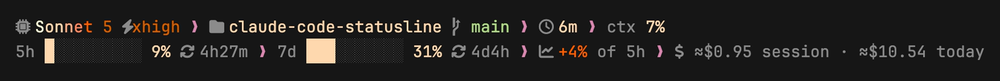

A brand-new session on a quiet day

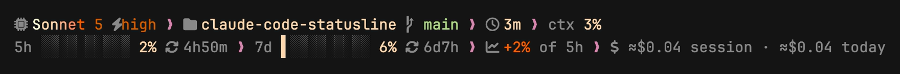

Four hours deep: the 5h window is nearly spent and turns critical

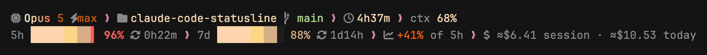

Plenty of 5h headroom left, but the weekly window is almost gone

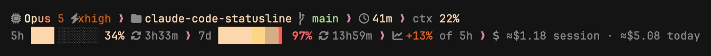

Context window at 91%, shortly before a compact

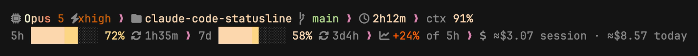

An API-key account: no rate-limit data, so line two degrades to the spend estimate

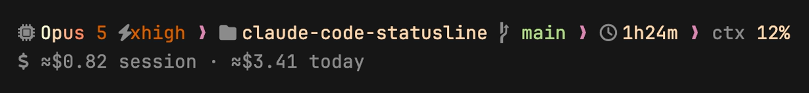

Only the 5h window reported so far, early in a session

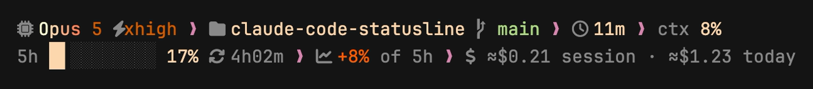

</details>
<details>
<summary><b>The spend slot</b></summary>

Its four states, in the order you'd meet them.

The default: a dim, self-measured estimate of session and daily spend


5h window exhausted, with no credits information to go on

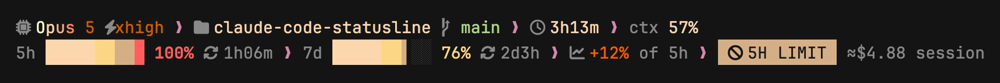

5h window exhausted and extra usage is switched off: nothing to do but wait

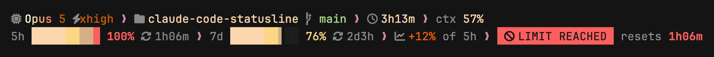

Past the 5h window on extra usage: real credit figures replace the estimate

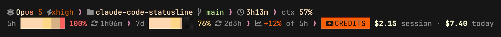

The same credits readout for a euro-billed account

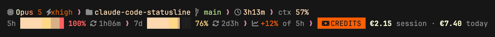

A zero-decimal currency: yen figures keep no fractional part

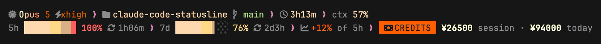

</details>
<details>
<summary><b>Icon sets</b></summary>

The same session with each `--icons` value.

--icons=nerd (default): a Nerd Font's glyphs


--icons=unicode: plain Unicode, no Nerd Font needed

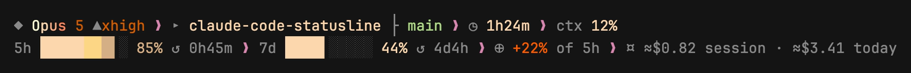

--icons=ascii: pure ASCII, for terminals that can't do better — the spend figures fall back with the icons (`~` for estimates, `|` as separator, ISO codes for currency symbols that aren't ASCII)


</details>
<details>
<summary><b>Subagent rows</b></summary>

`ember-subagent` renders the same grammar, narrower, one row per task.

ember-subagent: running, queued, done and failed rows

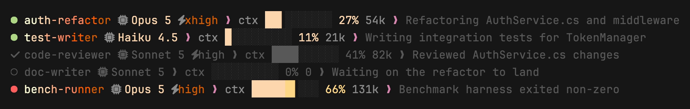

The same rows with --icons=unicode

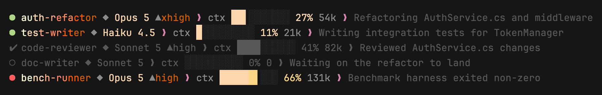

The same rows with --icons=ascii

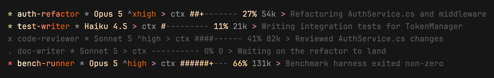

Subagent rows at 80 columns: the description truncates, nothing else

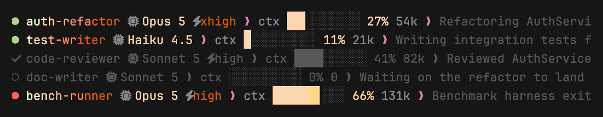

</details>
<details>
<summary><b>The model gradient</b></summary>

Model names are coloured by an ember gradient across their own characters.

Opus 5

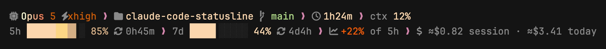

Sonnet 5


Haiku 4.5

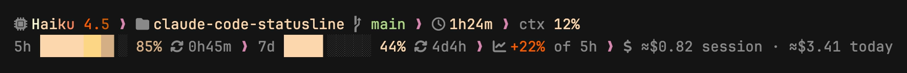

Opus 4.1

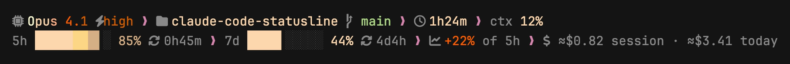

</details>
<details>
<summary><b>Missing or unusual data</b></summary>

Segments disappear rather than render as blanks or placeholders.

A directory that isn't a git repo: the branch segment simply isn't there

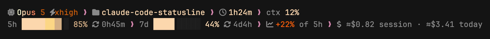

Detached HEAD: the short SHA stands in for the branch name

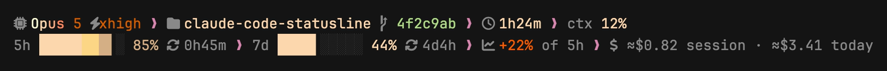

A long branch name, untouched: project and branch never shed on width

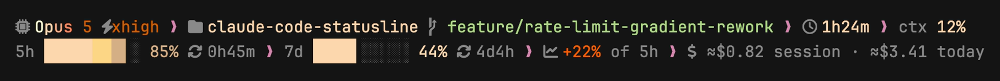

Just after /compact, while the context reading is still absent

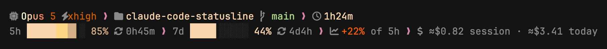

A model with no reasoning-effort setting

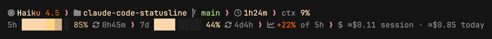

</details>
<details>
<summary><b>Narrow terminals</b></summary>

One session, shed segment by segment. Nothing wraps and nothing truncates mid-glyph.

120 columns: everything fits


100: the 7d countdown is the first thing to go

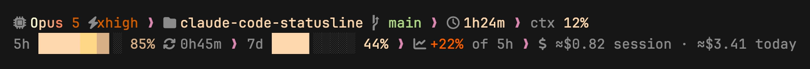

93: both bars halve to five cells

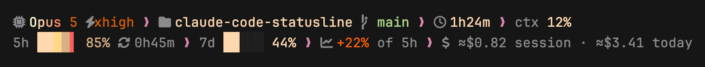

83: the spend slot loses its words

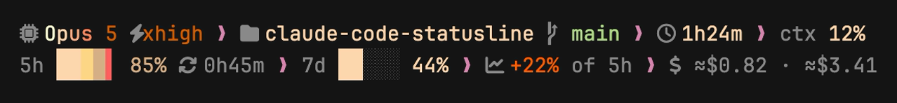

69: the spend slot goes

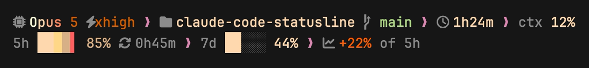

68: line one starts shedding, beginning with ctx

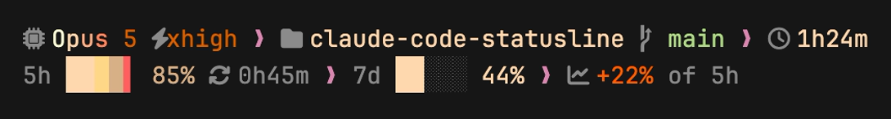

58: the session clock goes

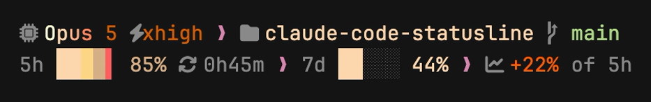

49: the session's share of the 5h window goes

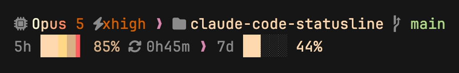

48: reasoning effort goes — project and branch never shed on width

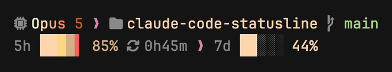

</details>

## Installing

### Prerequisites

- macOS or Linux (Native AOT supports Windows too, but distribution here targets only these two platforms)
- [.NET 10 SDK](https://dotnet.microsoft.com/download) to build from source
- A [Nerd Font](https://www.nerdfonts.com) in your terminal for the default icon set — e.g. `brew install --cask font-jetbrains-mono-nerd-font`, then select *JetBrainsMono Nerd Font* in your terminal. Without one, pass `--icons=unicode` (works with the preinstalled Menlo on macOS) or `--icons=ascii`.

### Build from source

There's no published release yet, so building from source is the way to install this today:

```sh
git clone https://github.com/toni-schmitt/claude-code-statusline.git
cd claude-code-statusline

dotnet publish -c Release -r <RID> -p:PublishAot=true src/Ember/Ember.csproj -o out
dotnet publish -c Release -r <RID> -p:PublishAot=true src/Ember.Subagent/Ember.Subagent.csproj -o out
```

`<RID>` is your platform's runtime identifier: `osx-arm64`, `osx-x64`, `linux-x64`, or `linux-arm64`. This produces two self-contained native binaries — `out/ember` and `out/ember-subagent` — with no further dependencies.

Put both somewhere on your `PATH`:

```sh
mkdir -p ~/.local/bin
cp out/ember out/ember-subagent ~/.local/bin/
```

## Configuring Claude Code

Let `ember` write the config for you:

```sh
ember --install
```

This merges the status line block into your existing `~/.claude/settings.json` (rather than overwriting it) using the binary's own resolved path.

Or configure it by hand:

```jsonc
// ~/.claude/settings.json
{
  "statusLine": {
    "type": "command",
    "command": "/absolute/path/to/ember",
    "refreshInterval": 15
  },
  "subagentStatusLine": {
    "type": "command",
    "command": "/absolute/path/to/ember-subagent"
  }
}
```

`refreshInterval: 15` matters: the session clock and both countdowns are time-based and would otherwise only update when Claude Code re-runs the command for an unrelated reason. Fifteen seconds keeps them visibly live without spending more than a fraction of a percent of a core (native startup is ~8ms).

### Flags

Set these on the command itself, e.g. `"command": "/path/to/ember --icons=unicode"`.

| Flag | Default | Effect |
|---|---|---|
| `--icons=nerd\|unicode\|ascii` | `nerd` | Icon set |
| `--git-dirty` | off | Reserved for a future git dirty-flags feature; currently a no-op |
| `--weekly-per-model` | off | Reserved for future per-model weekly rate-limit windows; currently a no-op |
| `--refresh` | — | Runs the detached usage-cache refresh; not for `settings.json` |
| `--install` | — | Writes the settings block above into `settings.json` |

### Trying it without a live session

```sh
echo '{"model":{"display_name":"Opus 5"},"effort":{"level":"xhigh"},
"workspace":{"project_dir":"/x/claude-code-statusline","current_dir":"/x"},
"session_id":"test","cost":{"total_cost_usd":0.82,"total_duration_ms":5040000},
"context_window":{"used_percentage":12},
"rate_limits":{"five_hour":{"used_percentage":85,"resets_at":1789142400},
"seven_day":{"used_percentage":44,"resets_at":1789574400}}}' | ./out/ember
```

## How it works, briefly

- Everything on line 1, and the bars/countdowns/spend estimate on line 2, comes straight from the JSON Claude Code writes to stdin on every render — no network call is ever on the render path.
- Real credit figures and the escalated "at-limit" / "blocked" / "credits" banners come from a detached background process that polls Claude's usage endpoint at most once every 45 seconds, caching the result in `$TMPDIR`. A render reads that cache and returns immediately; it never waits on the network.
- If the API is unreachable, expired, or simply hasn't been polled yet, nothing on the line breaks — it just reports the more conservative, stdin-only truth instead.

## Development

```sh
dotnet build Ember.slnx
dotnet test tests/Ember.Tests/Ember.Tests.csproj
```

## License

MIT — see [LICENSE](LICENSE).

## AI Honesty

This project was completely generated by LLMs.

<a href="https://www.aihonestybadge.com" target="_blank" rel="noopener"></a>
